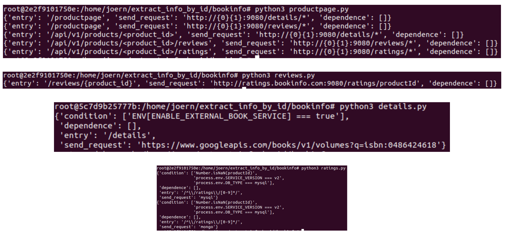

# Bookinfo, Online_Boutique, and Sock_shop


## Directory introduction
These three applications are parsed using server model in Joern. First, we should initiate it by ```joern --server```, then run the python scripts within the directory of Joern_parsing_codes. To parse Bookinfo, we should go to directory of bookinfo while we can use parse_java.py, parse_javascript.py, and parse_python.py to parse Online_Boutique and Sock_shop.


However, we did these experiments with old version of Joern, Joern updates frequently, right now it get stuck with initiation errors when using old version from the beginning. Therefore, we give two screenshots to show the parsing results of Bookinfo.
## Bookinfo parsing results

## Bookinfo call chain results


