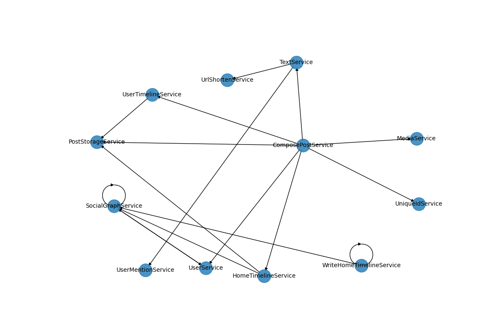
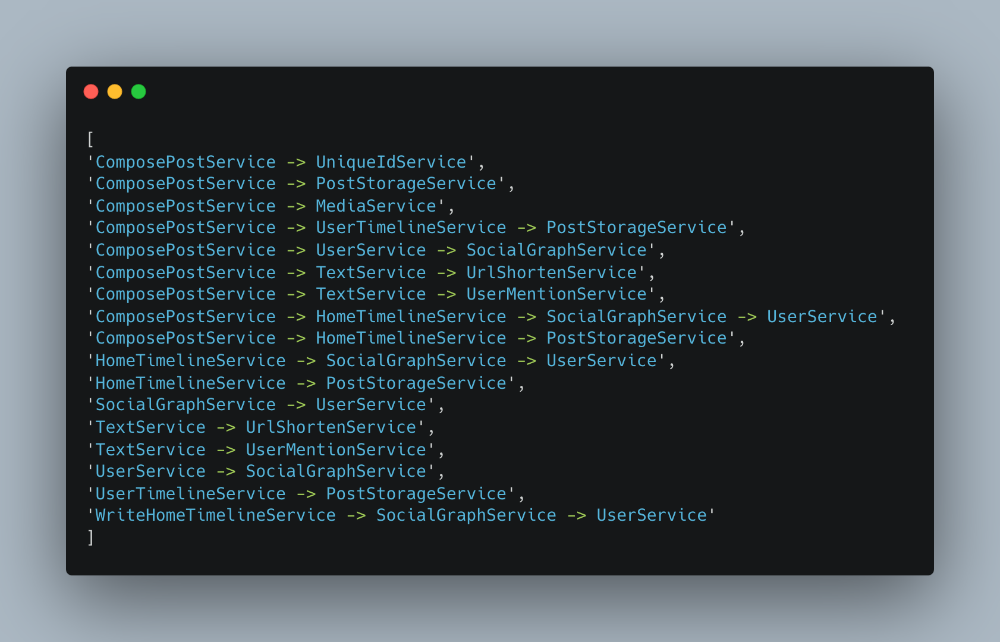

# Microservice RPC call chain analysis

## Call Relationship Graph



## RPC Call Policy



## rpc_call_chain_policy.txt

This is the call chain policy we discussed in our meeting, as shown in the following diagram.

```
[
'ComposePostService -> UniqueIdService', 
'ComposePostService -> PostStorageService', 
'ComposePostService -> MediaService', 
'ComposePostService -> UserTimelineService -> PostStorageService', 
'ComposePostService -> UserService -> SocialGraphService', 
'ComposePostService -> TextService -> UrlShortenService', 
'ComposePostService -> TextService -> UserMentionService', 
'ComposePostService -> HomeTimelineService -> SocialGraphService -> UserService', 
'ComposePostService -> HomeTimelineService -> PostStorageService', 
'HomeTimelineService -> SocialGraphService -> UserService', 
'HomeTimelineService -> PostStorageService', 
'SocialGraphService -> UserService', 
'TextService -> UrlShortenService', 
'TextService -> UserMentionService', 
'UserService -> SocialGraphService', 
'UserTimelineService -> PostStorageService', 
'WriteHomeTimelineService -> SocialGraphService -> UserService'
]
```

## func_call_dependency_graph.png

This is a representation of the call relationships between microservices shown in an image format.

## print_dependency_graph_file_base.py
We use this file to generate an image that displays the call relationships between microservices.

## lsc-socialNetwork-file-base-dependency-graph-output.log.json

This is a JSON document containing the call relationships between microservices.

We focus on the following fields:
- current_service_handler: The handler of the current microservice
- current_service_name: The name of the current microservice
- rpc_func_name: The function provided by the downstream microservice
- call_service_handler: The handler of the downstream microservice
- call_service_name: The name of the downstream microservice
- current_service_method_full_name: The function of the current microservice
- rpc_func_name_symbol: The function and parameter information of the downstream microservice